[简体中文](./README.md) · [Website](https://xpref.lei6393.com) · [GitHub](https://github.com/SuperMarioYL/xpref)

<picture>
  <source media="(max-width: 600px) and (prefers-color-scheme: dark)" srcset="./assets/presentation/hero-mobile-dark.svg">
  <source media="(max-width: 600px)" srcset="./assets/presentation/hero-mobile-light.svg">
  <source media="(prefers-color-scheme: dark)" srcset="./assets/presentation/hero-dark.svg">
  
</picture>

# xpref

**Inspect expert predictions before testing a prefetch policy.**

xpref combines recent router logits and observed expert transitions to predict next-token expert IDs, evaluates those predictions on saved traces and can hint mapped checkpoint ranges to the OS.

## Why use it

A prefetch experiment needs both a prediction and an exact mapping from an expert to weight bytes. Saved traces let you study recall before bringing the predictor into an engine and measuring actual I/O.

- **Compare next-token sets** — Predictions are scored against the following token.
- **Inspect mapping separately** — Explicit ranges keep layout assumptions visible.
- **Separate recall from speed** — JSON labels projected throughput alongside recall.

## Architecture

<picture>
  <source media="(max-width: 600px) and (prefers-color-scheme: dark)" srcset="./assets/presentation/architecture-mobile-dark.svg">
  <source media="(max-width: 600px)" srcset="./assets/presentation/architecture-mobile-light.svg">
  <source media="(prefers-color-scheme: dark)" srcset="./assets/presentation/architecture-dark.svg">
  
</picture>

Trace or ring records supply per-layer logits and fired IDs. Predictor blends a softmax prior with decayed transition counts and chooses the active-set size. ExpertLayout maps IDs to ranges; Prefetcher uses mmap and MADV_WILLNEED. Evaluation compares each prediction with the next token’s actual set.

| Component | Responsibility |
| --- | --- |
| `Trace / ring input` | src/xpref/trace.py; ringbuf.py |
| `Expert predictor` | src/xpref/predictor.py |
| `Byte-range layout` | src/xpref/prefetch.py |
| `Advisory readahead` | mmap + MADV_WILLNEED |
| `Recall evaluation` | src/xpref/attach.py |

## Install and quickstart

Use the runtime version declared in the repository manifest. The source installation below makes the included example reproducible.

```bash
git clone https://github.com/SuperMarioYL/xpref.git
cd xpref
python3.12 -m venv .venv
source .venv/bin/activate
python -m pip install -e .
```

Python 3.10+; the shown installation uses 3.12. The demo evaluates the complete 128-token synthetic trace and hints one page-aligned synthetic file range.

```bash
.venv/bin/python examples/presentation_demo.py
```

## Recorded demo

<picture>
  <source media="(max-width: 600px) and (prefers-color-scheme: dark)" srcset="./assets/presentation/process-mobile-dark.svg">
  <source media="(max-width: 600px)" srcset="./assets/presentation/process-mobile-light.svg">
  <source media="(prefers-color-scheme: dark)" srcset="./assets/presentation/process-dark.svg">
  
</picture>

The predictor reports recall on the synthetic trace; the file experiment reports only whether an advisory range hint was accepted.

```text
Synthetic trace evaluation; t/s fields are formula projections:
{
  "num_tokens": 128,
  "num_layers": 8,
  "num_experts": 896,
  "num_active": 16,
  "recall_at_k": 0.8153912401574803,
  "recall_at_16": 0.8153912401574803,
  "per_layer_recall": [
    0.8208661417322834,
    0.8095472440944882,
    0.8115157480314961,
    0.8188976377952756,
    0.8125,
    0.8154527559055118,
    0.8184055118110236,
    0.8159448818897638
  ],
  "predictions_made": 1016,
  "reactive_tps": 4.0,
  "projected_predictive_tps": 12.0,
  "speedup": 3.0
}
{"synthetic_checkpoint_bytes": 16384, "hint_api_available": true, "hinted_offset": 4096, "hinted_bytes": 4096}
```

The complete command and output are recorded in [docs/demo-results.json](./docs/demo-results.json). Inputs and reproduction code are included in the repository.


The existing GIF is drawn by scripts/gen_demo_gif.py with preset text; it is an illustration, not a live hardware recording. Use the actual output above for the reproducible result.

## Usage

Run these commands from the repository root after installation. Replace paths for your own data.

```bash
xpref trace-info --trace samples/k3-q4-128tok.bin
xpref eval --trace samples/k3-q4-128tok.bin --json
xpref eval --trace samples/k3-q4-128tok.bin --topk-weight 1 --ngram-weight 0
# After adapting and validating your own engine ring and tensor layout:
xpref attach --ring /path/to/router.xring --checkpoint /path/to/weights.gguf --layout /path/to/layout.json --max-tokens 128
```

## Configuration

eval accepts --ngram-n (3), --topk-weight (0.6) and --ngram-weight (0.4). attach requires --checkpoint and takes either --replay or --ring; a bare ring name resolves under the platform shared-memory/temp location. --layout is JSON {layer: {expert_id: [offset, length]}}. patch-path locates the reference patch for inspection. Measure engine throughput independently when evaluating a real integration.

## Integrations and responsibilities

<picture>
  <source media="(max-width: 600px) and (prefers-color-scheme: dark)" srcset="./assets/presentation/integrations-mobile-dark.svg">
  <source media="(max-width: 600px)" srcset="./assets/presentation/integrations-mobile-light.svg">
  <source media="(prefers-color-scheme: dark)" srcset="./assets/presentation/integrations-dark.svg">
  
</picture>

Choose the input and output route that matches your workflow. The local example below exercises the stated subset.

| Route | Implemented role |
| --- | --- |
| Binary router trace | Offline logits and fired IDs |
| Ring buffer | Prototype live record consumer |
| Explicit JSON layout | Expert-to-byte mapping |
| mmap / madvise | OS page-cache hints |
| CLI JSON | Recall and formula projections |

## Limits and next steps

- The bundled K3-labelled trace is synthetic, generated by scripts/gen_sample_trace.py. Its recall is not measured model accuracy, and 4/12 t/s are hardcoded projection assumptions rather than hardware measurements.
- MADV_WILLNEED is advisory; hinted byte counts do not establish disk reads, residency or throughput gain. Uniform layout is only a synthetic approximation; real weights need verified ranges.
- The bundled engine patch is an illustrative reference requiring adaptation, not a validated drop-in llama.cpp integration. This demo does not attach a live model or move data into GPU memory.

A verified engine producer, exact GGUF layout extraction and measured end-to-end performance are the next integration steps. GPU/pinned-memory staging is outside the current path.

## License and contributions

See [LICENSE](./LICENSE). When reporting an issue, include a minimal input, the command, and the observed output.
