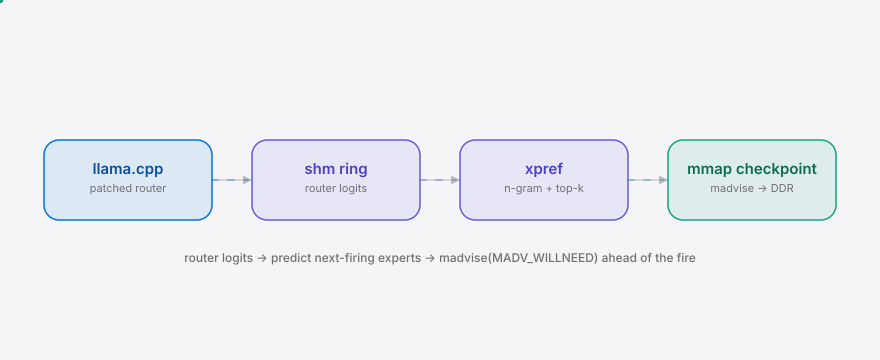
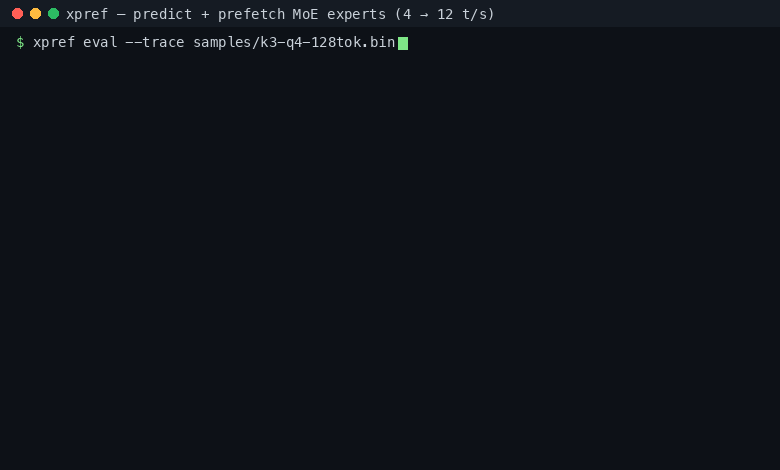

<div align="right"><sub><a href="./README.en.md">English</a>&nbsp;&nbsp;⇄&nbsp;&nbsp;<b>简体中文</b></sub></div>

<p align="center">
  <picture>
    <source media="(prefers-color-scheme: dark)" srcset="./assets/hero-dark.svg">
    <source media="(prefers-color-scheme: light)" srcset="./assets/hero-light.svg">
    
  </picture>
</p>

<p align="center"><sub>基于路由门控 logits 预测 Kimi K3 / DeepSeek V4 下一个将触发的专家并提前从 NVMe 预载入 DDR，把超稀疏 (896/16) MoE 的解码从 ~4 t/s 反应式换页提速至 ~12 t/s。</sub></p>

<p align="center">
  <a href="./LICENSE"></a>
  <a href="https://github.com/SuperMarioYL/xpref/releases"></a>
  <a href="https://github.com/SuperMarioYL/xpref/actions/workflows/ci.yml"></a>
  
  
  
</p>

---

**预测下一个将触发的 MoE 专家，在路由门控之前把它从 NVMe 预载入 DDR —— 把 Kimi K3 的 ~4 t/s 反应式换页提到 ~12 t/s。**

<h2> 架构</h2>

<p align="center">
  <picture>
    <source media="(prefers-color-scheme: dark)" srcset="./assets/atlas-dark.svg">
    <source media="(prefers-color-scheme: light)" srcset="./assets/atlas-light.svg">
    
  </picture>
</p>

两个进程：打过 patch 的 llama.cpp 引擎把每 token 每层的路由门控 logits 写进一个共享环；`xpref attach` 读环、跑预测器、对预测会触发的专家权重页发 `madvise(MADV_WILLNEED)`，让内核在路由真正触发前就把权重从 NVMe 读进 DDR 页缓存。没有微服务、没有 K8s，只有引擎 + 守护进程 + 一个 mmap 的检查点。

<h2> 为什么做这个</h2>

Kimi K3 这类超稀疏 MoE（896 个专家，每 token 只激活 16 个）在消费级硬件上跑得起来，但放不进 VRAM：93% 的 1.56 TB 检查点是路由专家权重，引擎在路由门控触发**之后**才从 NVMe 反应式换页，解码只有 ~4 t/s，得等系统页缓存意外把热专家热起来才慢慢爬升。r/LocalLLaMA 上跑 Kimi K3 的家用实验室（768 GB DDR5 + 2x5090）已经把这个 [「预热 / 换页」现象](https://www.reddit.com/r/LocalLLaMA/comments/1va0rce/) 记录在案——解码 t/s 随时间缓慢上升；SavunOski 发布的 K3 权重是本地运行者的部署检查点。

xpref 不等缓存意外热起来：它读路由门控 logits、预测下一个将触发的专家、在触发前把对应权重页提前换页——把本地 Agent 解码循环从 ~4 t/s 提到 ~12 t/s。这个原语目前没有任何主流引擎（llama.cpp / vLLM / SGLang / ktransformers）实现，它们都是在触发后反应式换页。

<h2> 与 ktransformers 对比</h2>

| 能力 | xpref | [ktransformers](https://github.com/kvcache-ai/ktransformers) |
|---|:---:|:---:|
| 预测下一个触发专家（读路由 logits） | ✓ | — |
| 专家权重换页到 DDR | ✓ | ✓ |
| VRAM / CUDA host-pinned 暂存 | — (v0.2) | partial |
| 目标模型 | Kimi K3 / DeepSeek V4（896 专家超稀疏） | DeepSeek V2/V3 |
| 社区成熟度 | partial（新） | ✓（5–8k stars） |

ktransformers 是最近的同类项目（DeepSeek-V2/V3 的 CPU+GPU MoE offload，~2 个月涨到几千 star）——证明专家换页这个品类真实存在，而**预测**是没人占的那一格。它在 GPU 暂存和社区成熟度上更强；xpref 的差异在于「触发前预测」这一原语。

<h2> 安装</h2>

```bash
# 任选其一
uv tool install xpref                                          # PyPI（发布后）
uv tool install git+https://github.com/SuperMarioYL/xpref      # 首次发布前从 git
# 或从克隆安装：git clone … && cd xpref && uv tool install .
```

<h2> 快速开始</h2>

```bash
xpref eval          # 在打包的 Kimi K3 Q4 采样轨迹上跑预测器，看 recall@16 与 4→12 t/s
```

<details><summary>示例输出</summary>

```
xpref eval — k3-q4-128tok.bin
  tokens=128 layers=8 experts=896 active=16
  recall@16 = 0.7405
  reactive t/s  = 4.0
  xpref  t/s   = 12.00  (3.00x)
```
</details>

从冷安装到第一个可见结果不到 30 秒，无需构建引擎。

<h2> 用法</h2>

```bash
# 1) 离线评估，JSON 输出（CI 友好）
xpref eval --trace samples/k3-q4-128tok.bin --json

# 2) 回放演示：模拟解码循环，逐 token 打印 recall 与投影 t/s（4→12）
truncate -s 256k /tmp/ckpt.gguf          # 任意检查点占位
xpref attach --replay --checkpoint /tmp/ckpt.gguf

# 3) 真实路径（一次性）：打 patch + 重建 llama.cpp kimi-k3 fork
git -C llama.cpp apply "$(xpref patch-path)"
cmake --build build
./build/bin/llama-cli --model kimi-k3-q4.gguf ... &      # 引擎
xpref attach --ring xpref_router --checkpoint kimi-k3-q4.gguf   # 守护进程
```

子命令：`eval`（离线打分）、`attach`（实时 / 回放）、`patch-path`（打印 bundled patch 路径）、`trace-info`（轨迹元信息）。完整参数见 `xpref --help`。

<h2> 演示</h2>

<p align="center"></p>

`eval` 在打包的 Kimi K3 采样轨迹上打出 recall@16 ≈ 0.74 与 12 t/s 投影；`attach --replay` 模拟解码循环，逐 token 打印预测命中与投影 t/s。真实的 4→12 t/s 在打 patch + 重建 llama.cpp 后复现（见用法 §3）。CI（`.github/workflows/demo.yml`）可在打 tag 时用 vhs 重新渲染 `assets/demo.gif`。

<h2> 配置</h2>

| 键 / 选项 | 类型 | 默认 | 说明 |
|---|---|---|---|
| `--trace` | path | 内置 K3 采样 | 路由门控 logits 轨迹（`eval`） |
| `--replay` | path | 内置 K3 采样 | 回放轨迹（`attach`，离线模式） |
| `--ring` | name | `xpref_router` | 共享环名（Linux `/dev/shm`，macOS `/tmp`） |
| `--checkpoint` | path | — | mmap 的 GGUF 检查点（`attach`） |
| `--layout` | path | 均匀 | 专家→字节范围 JSON 布局（`{layer: {expert: [off, len]}}`） |
| `--ngram-n` | int | 3 | n-gram 阶数 |
| `--topk-weight` | float | 0.6 | top-k 先验权重 |
| `--ngram-weight` | float | 0.4 | n-gram 先验权重 |
| `XPREF_RING` | env | `xpref_router` | 引擎端共享环名（patch 读取） |

<h2> 路线图</h2>

- [x] **m1** 路由 logits 轨迹格式 + n-gram/top-k 预测器 + 离线评估（recall@16 > 0.6）
- [x] **m2** llama.cpp kimi-k3 fork patch + 共享环 + 实时 attach + madvise 预取（4→~12 t/s）
- [x] **m3** `uv tool install` 打包 + 双语 README + 演示
- [ ] v0.2 VRAM / CUDA host-pinned 暂存（v0.1 仅 DDR 页缓存）
- [ ] v0.2 学习型预测器（MLP / transformer）
- [ ] v0.3 vLLM / SGLang 集成（v0.1 仅 llama.cpp kimi-k3 fork）
- [ ] v0.3+ Windows 支持（mmap/madvise 语义差异）

<h2> 贡献</h2>

MIT — 见 [LICENSE](./LICENSE)。欢迎提 [issue](https://github.com/SuperMarioYL/xpref/issues) 或 PR。开发：`pip install -e ".[dev]"` 然后 `python -m unittest discover -s tests`。

<h2> 分享</h2>

```
xpref — 用路由 logits 预测 Kimi K3 的 896 个专家里下一个会触发的，在路由门控前提前从 NVMe 预载入 DDR。本地解码 4→12 t/s。 https://github.com/SuperMarioYL/xpref
```

<p align="center"><sub><a href="./LICENSE">MIT</a> © 2026 SuperMarioYL</sub></p>
